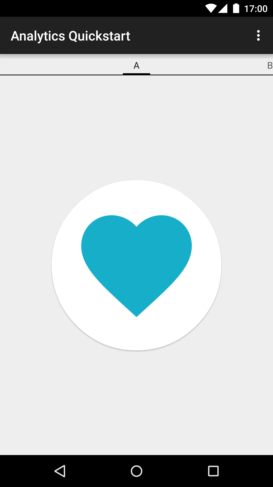

Google Analytics Quickstart
===========================

Google Analytics Android Quickstart app demonstrates collecting
app usage analytics via [Tracker](https://developer.android.com/reference/com/google/android/gms/analytics/Tracker.html)
available in Google Play Services. HitBuilders.ScreenViewBuilder is used to
send screen view analytics.

Introduction
------------

- [Read more about Google Analytics](https://developers.google.com/analytics/)

Getting Started
---------------

- Follow the [quickstart guide](https://developers.google.com/analytics/devguides/collection/android/v4/start)
  to set up your project in Android Studio.
  - Make sure to replace `ga_trackingId` in `res/xml/global_tracker.xml`
    with your Google Analytics tracking ID.
- Run the sample on your Android device or emulator.
- Swipe between images to register screen views.
- View collected analytics via [Google Analytics](https://www.google.com/analytics/web).

Screenshots
-----------

Support
-------

- Stack Overflow: http://stackoverflow.com/questions/tagged/google-analytics

If you've found an error in this sample, please file an issue:
https://github.com/googlesamples/google-services/issues

Patches are encouraged, and may be submitted by forking this project and
submitting a pull request through GitHub.

License
-------

Copyright 2015 Google, Inc.

Licensed to the Apache Software Foundation (ASF) under one or more contributor
license agreements.  See the NOTICE file distributed with this work for
additional information regarding copyright ownership.  The ASF licenses this
file to you under the Apache License, Version 2.0 (the "License"); you may not
use this file except in compliance with the License.  You may obtain a copy of
the License at

  http://www.apache.org/licenses/LICENSE-2.0

Unless required by applicable law or agreed to in writing, software
distributed under the License is distributed on an "AS IS" BASIS, WITHOUT
WARRANTIES OR CONDITIONS OF ANY KIND, either express or implied.  See the
License for the specific language governing permissions and limitations under
the License.
